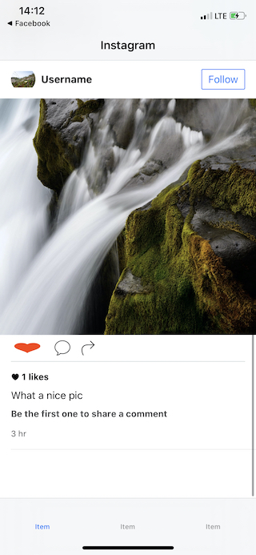

# Instagram (Clone)

## Description
The app allows users to upload photos and videos to the service, which can be edited with various filters, and organized with tags and location information. An account's posts can be shared publicly or with pre-approved followers. Users can browse other users' content by tags and locations, and view trending content. Users can "like" photos, and follow other users to add their content to a feed.

## Demo
### feature/design-welcome-screen
| Screenshot 01 |
| ------------- |
|  |

### feature/design-login-and-signup-screens
| Screenshot 02 | Screenshot 03 |
| ------------- | ------------- |
|  |  |

### feature/design-upload-profile-photo-screen
| Screenshot 04 |
| ------------- |
|  |

### feature/custom-image-picker
| Screenshot 05 | Screenshot 06 |
| ------------- | ------------- |
|  |  |

### feature/app-icon
| Screenshot 07 |
| ------------- |
|  |

### feature/integrate-firebase-with-cocoapods
> On this section there is no demo, because is the same as before.
> Here we just link our app with `Firebase`, the `GoogleService-Info.plist` is not on the repo, so, create a new `Firebase` project and download your own file.

### feature/factor-image-uploading-code
> On this section there is no demo, because is the same as before.
> We create an extension of `UIImage` to let the image be uploaded to `Firebase Storage`.

### feature/upload-user-data-to-firestore
> On this section there is no demo, because is the same as before.
> We create a data model for user with an extension to `Firebase` to be able to save it on `Firestore`

### feature/signup-view-controller
> On this section there is no demo, because is the same as before.
> We create the `ViewController` for the `Sign Up` Screen.

### feature/signup-users-and-save-to-firebase
> On this section there is no demo, because is the same as before.
> We add the code to Authenticate|SignIn|Save authenticated data on `Firebase`.

### feature/observe-user-login-and-download-current-user-data
| Screenshot 08 |
| ------------- |
|  |

### feature/logout-users
| Screenshot 09 |
| ------------- |
|  |

### feature/login-users
| Screenshot 10 | Screenshot 11 |
| ------------- | ------------- |
|  |  |

### feature/design-post-composer
| Screenshot 12 |
| ------------- |
|  |

### feature/code-post-composer-vc
> On this section there is no demo, because is the same as before.
> We add the code to `PostComposerTableViewController` to be able to get the user info and be prepare to upload the post.

### feature/create-post-model-class
> On this section there is no demo, because is the same as before.
> We create our `Post` class to be the model of our posts and add the code to save on Firebase.

### feature/share-a-new-post
> On this section there is no demo, because is the same as before.
> We add the code to the `PostComposerTableViewController` to use the `Post` model and upload the post data on `Firestore`.

### feature/trigger-imagepicker-when-tap-on-camera-tab
| Screenshot 13 | Screenshot 14 |
| ------------- | ------------- |
|  |  |

### feature/making-changes-newsfeed
> On this section there is no demo, because is the same as before.
> We bring the Newsfeed from the repo [fdorado985/InstagramNewsFeedUI](https://github.com/fdorado985/InstagramNewsFeedUI) and bring it on this project.

### feature/fetch-posts-to-newsfeed
| Screenshot 15 |
| ------------- |
|  |

### feature/download-post-images
| Screenshot 16 |
| ------------- |
|  |

### feature/create-comment-composer-vc
| Screenshot 17 |
| ------------- |
|  |

### feature/create-comment-composer-vc
| Screenshot 17 |
| ------------- |
|  |

### feature/create-comment-class
> On this section, there is no difference with the change before, it was just create the new comment class, and the functionality will just look like before.

### share-comments
> On this section, there is no new view, it was created the functionality for the comment composer, now we can add comments to our posts.

### fetch-comments-and-design-post-detail
| Screenshot 18 |
| ------------- |
|  |

### create-comment-cell
> On this section we just created the logic for the comment cell, so the state of the app keep in the same way as the tag before.

### show-comment-composer-using-pop
| Screenshot 19 |
| ------------- |
|  |

### populate-comments-to-tableview
| Screenshot 20 |
| ------------- |
|  |

### like-posts
| Screenshot 21 |
| ------------- |
|  |