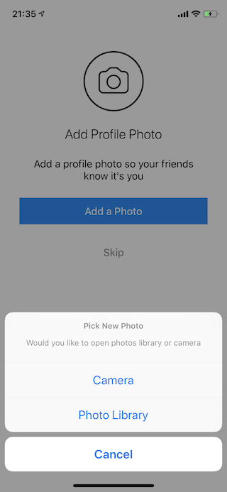

# Instagram (Clone)

## Description
The app allows users to upload photos and videos to the service, which can be edited with various filters, and organized with tags and location information. An account's posts can be shared publicly or with pre-approved followers. Users can browse other users' content by tags and locations, and view trending content. Users can "like" photos, and follow other users to add their content to a feed.

## Demo
### feature/design-welcome-screen
| Screenshot 01 |
| ------------- |
|  |

### feature/design-login-and-signup-screens
| Screenshot 02 | Screenshot 03 |
| ------------- | ------------- |
|  |  |

### feature/design-upload-profile-photo-screen
| Screenshot 04 |
| ------------- |
|  |

### feature/custom-image-picker
| Screenshot 05 | Screenshot 06 |
| ------------- | ------------- |
|  |  |

### feature/app-icon
| Screenshot 07 |
| ------------- |
|  |

### feature/integrate-firebase-with-cocoapods
> On this section there is no demo, because is the same as before.
> Here we just link our app with `Firebase`, the `GoogleService-Info.plist` is not on the repo, so, create a new `Firebase` project and download your own file.

### feature/factor-image-uploading-code
> On this section there is no demo, because is the same as before.
> We create an extension of `UIImage` to let the image be uploaded to `Firebase Storage`.

### feature/upload-user-data-to-firestore
> On this section there is no demo, because is the same as before.
> We create a data model for user with an extension to `Firebase` to be able to save it on `Firestore`

### feature/signup-view-controller
> On this section there is no demo, because is the same as before.
> We create the `ViewController` for the `Sign Up` Screen.

### feature/signup-users-and-save-to-firebase
> On this section there is no demo, because is the same as before.
> We add the code to Authenticate|SignIn|Save authenticated data on `Firebase`.

### feature/observe-user-login-and-download-current-user-data
| Screenshot 08 |
| ------------- |
|  |